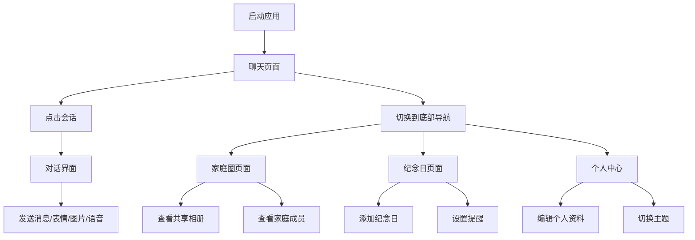

## 1. 产品概述

暖聊是一款专为亲人挚友打造的私密聊天软件，致力于为亲密关系提供温暖、安全、有温度的沟通空间。不同于大众社交平台的繁杂，暖聊聚焦于最亲近的人，让每一次对话都充满心意。

- **核心价值**：为家人和挚友打造专属的私密沟通空间，让亲密关系更有温度
- **目标用户**：注重家庭亲情、珍惜挚友情谊，追求高品质私密沟通的人群
- **产品定位**：小而美、温暖治愈、专属于亲密关系的聊天应用

## 2. 核心功能

### 2.1 用户角色

| 角色 | 注册方式 | 核心权限 |
|------|----------|----------|
| 普通用户 | 手机号/昵称注册 | 创建/加入家庭群、发送消息、共享相册、设置纪念日 |

### 2.2 功能模块

1. **聊天页面**：消息列表、对话界面、表情发送、语音消息
2. **家庭圈页面**：家庭群组、成员管理、共享相册
3. **纪念日页面**：重要日期提醒、倒计时、祝福卡片
4. **个人中心页面**：个人资料、设置、主题切换

### 2.3 页面详情

| 页面名称 | 模块名称 | 功能描述 |
|----------|----------|----------|
| 聊天页面 | 会话列表 | 展示最近聊天，支持搜索，显示未读消息数 |
| 聊天页面 | 对话界面 | 气泡式消息展示，支持文字、表情、图片、语音 |
| 聊天页面 | 输入区域 | 文字输入、表情选择、图片发送、语音录制 |
| 家庭圈页面 | 家庭群组卡片 | 展示家庭群，显示成员头像、最新动态 |
| 家庭圈页面 | 共享相册 | 家庭照片墙，支持上传、点赞、评论 |
| 家庭圈页面 | 成员列表 | 展示家庭成员，显示在线状态 |
| 纪念日页面 | 纪念日卡片 | 展示重要日期，倒计时显示，分类标签 |
| 纪念日页面 | 添加纪念日 | 选择日期类型、设置提醒、上传封面 |
| 个人中心页面 | 个人资料 | 头像、昵称、个性签名、心情状态 |
| 个人中心页面 | 设置 | 通知设置、隐私设置、主题切换 |

## 3. 核心流程

用户打开应用后，首先进入聊天页面查看最近消息。可以点击进入具体对话进行聊天，或切换到家庭圈查看共享相册和家庭成员动态。纪念日页面提醒 upcoming 的重要日期，用户可以添加新的纪念日并设置提醒。个人中心可编辑资料和切换主题。

## 4. 用户界面设计

### 4.1 设计风格

- **主色调**：暖橙色（#FF8A65）作为主色，传递温暖、治愈的感觉
- **辅助色**：柔粉色（#FFCDD2）、薄荷绿（#B2DFDB）、淡紫色（#E1BEE7）
- **背景色**：米白色（#FFF8F0）温暖背景，深色模式为深棕灰（#2D2A26）
- **按钮风格**：圆角胶囊形按钮，渐变填充，柔和阴影
- **字体**：标题使用「霞鹜文楷」展现手写信的温度感，正文使用「思源黑体」保证可读性
- **布局风格**：卡片式布局，柔和圆角，充足留白，温馨舒适
- **图标风格**：圆润线性图标，搭配暖色填充，亲切可爱
- **整体氛围**：如同置身于温暖的家中，每一处细节都传递着关爱与陪伴

### 4.2 页面设计概述

| 页面名称 | 模块名称 | UI 元素 |
|----------|----------|---------|
| 聊天页面 | 会话列表 | 圆角卡片、头像气泡、未读红点、时间标签、柔和分隔线 |
| 聊天页面 | 对话界面 | 气泡消息、头像、时间戳、渐变背景、入场动画 |
| 聊天页面 | 输入区域 | 圆角输入框、表情按钮、语音按钮、发送按钮动画 |
| 家庭圈页面 | 群组卡片 | 渐变封面、成员头像组、最新动态预览、悬浮效果 |
| 家庭圈页面 | 共享相册 | 瀑布流布局、图片卡片、点赞动效、柔和阴影 |
| 家庭圈页面 | 成员列表 | 头像圆环、在线状态点、昵称、淡入动画 |
| 纪念日页面 | 倒计时卡片 | 大字号倒计时、渐变背景、装饰元素、呼吸动画 |
| 纪念日页面 | 日期列表 | 分类标签、日期卡片、剩余天数、滑动删除 |
| 个人中心页面 | 资料卡片 | 圆形头像、渐变边框、昵称签名、编辑按钮 |
| 个人中心页面 | 设置列表 | 图标+文字、右箭头、分组标题、开关按钮 |

### 4.3 响应式

- 桌面端优先设计，三栏布局（导航+列表+详情）
- 移动端适配为单页堆叠，底部 Tab 导航
- 触摸交互优化：更大的点击区域、滑动手势支持
- 消息列表和相册支持下拉刷新、上拉加载更多

### 4.4 动效设计

- 页面切换：优雅的淡入淡出 + 轻微位移
- 消息发送：气泡弹出动画，从输入框平滑过渡到消息列表
- 表情选择：面板滑入效果，表情悬浮放大
- 纪念日倒计时：数字跳动动画，临近日期时呼吸灯效果
- 图片查看：缩放过渡动画，背景模糊
- 底部导航：选中图标上跳动效，颜色渐变过渡
