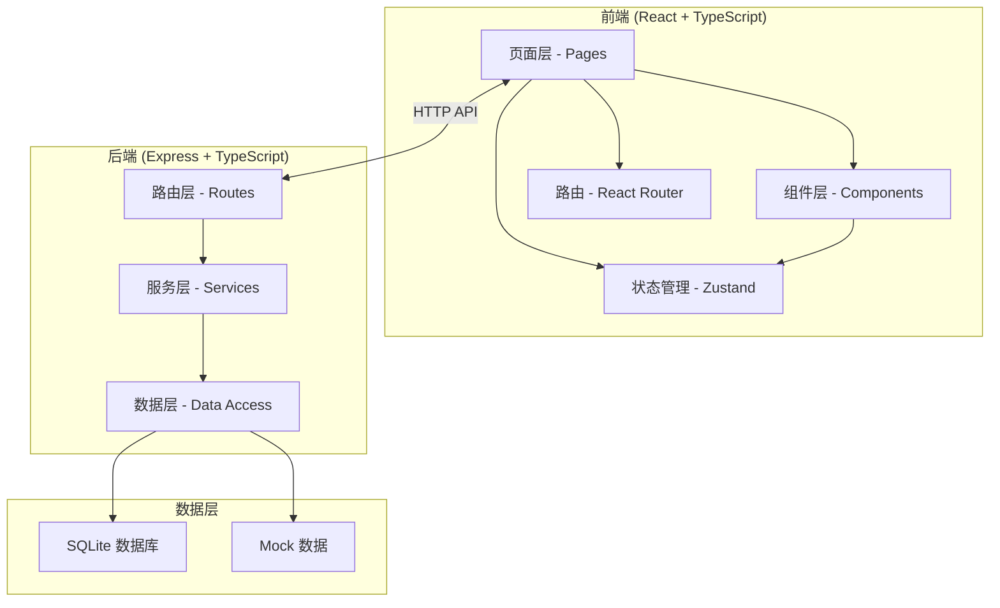
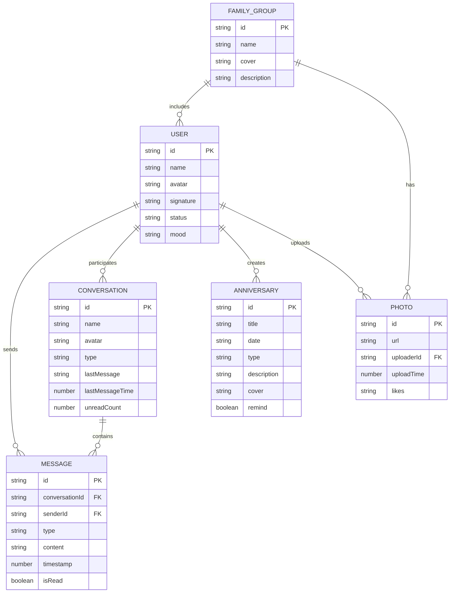

## 1. 架构设计



## 2. 技术描述

- **前端**：React@18 + TypeScript + Vite + TailwindCSS@3 + Zustand + React Router@6
- **后端**：Express@4 + TypeScript
- **数据库**：SQLite（轻量级，适合本地演示）+ Mock 数据
- **图标库**：lucide-react
- **初始化工具**：vite-init

## 3. 路由定义

### 前端路由

| 路由 | 页面 | 说明 |
|------|------|------|
| /chat | 聊天列表页 | 最近会话列表 |
| /chat/:id | 对话详情页 | 具体聊天对话 |
| /family | 家庭圈页 | 家庭群组和共享相册 |
| /anniversary | 纪念日页 | 重要日期提醒 |
| /profile | 个人中心 | 个人资料和设置 |

### 后端 API 路由

| 路由 | 方法 | 说明 |
|------|------|------|
| /api/messages | GET | 获取消息列表 |
| /api/messages/:id | GET | 获取会话消息 |
| /api/messages | POST | 发送消息 |
| /api/contacts | GET | 获取联系人列表 |
| /api/family | GET | 获取家庭群组信息 |
| /api/photos | GET | 获取共享相册 |
| /api/photos | POST | 上传照片 |
| /api/anniversaries | GET | 获取纪念日列表 |
| /api/anniversaries | POST | 添加纪念日 |
| /api/user | GET | 获取当前用户信息 |
| /api/user | PUT | 更新用户信息 |

## 4. API 类型定义

```typescript
// 用户
interface User {
  id: string;
  name: string;
  avatar: string;
  signature: string;
  status: 'online' | 'offline';
  mood?: string;
}

// 消息
interface Message {
  id: string;
  conversationId: string;
  senderId: string;
  type: 'text' | 'image' | 'voice' | 'emoji';
  content: string;
  timestamp: number;
  isRead: boolean;
}

// 会话
interface Conversation {
  id: string;
  name: string;
  avatar: string;
  type: 'single' | 'group';
  lastMessage: string;
  lastMessageTime: number;
  unreadCount: number;
  members?: User[];
}

// 纪念日
interface Anniversary {
  id: string;
  title: string;
  date: string;
  type: 'birthday' | 'wedding' | 'memorial' | 'other';
  description?: string;
  cover?: string;
  remind: boolean;
}

// 相册照片
interface Photo {
  id: string;
  url: string;
  uploaderId: string;
  uploadTime: number;
  likes: string[];
  comments?: PhotoComment[];
}

interface PhotoComment {
  id: string;
  userId: string;
  content: string;
  time: number;
}
```

## 5. 数据模型

### 5.1 ER 图



### 5.2 初始化数据

应用启动时自动初始化 Mock 数据，包括：
- 3-5 个模拟用户（家人和挚友）
- 若干会话和历史消息
- 3-5 个纪念日
- 若干共享相册照片
- 一个家庭群组
